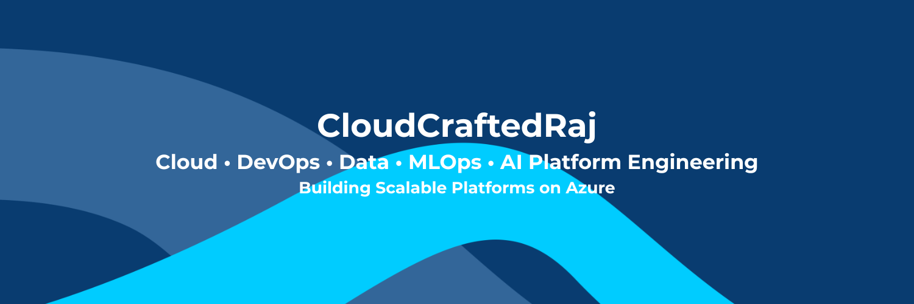

  

# 👋 Hi, I'm Raj (CloudCraftedRaj)

🚀 **Cloud • DevOps • Data • MLOps • AI Platform Engineer**

---

## ☁️ About Me

I am a Cloud and Data Engineering professional focused on designing and building scalable, secure, and automated platforms using the Microsoft Azure ecosystem.

My work combines cloud infrastructure, DevOps automation, modern data platforms, and AI-driven systems.

I strongly believe in **learning by building real-world systems and documenting the journey publicly**.

---

## 🛠 Core Skills

### ☁️ Cloud & DevOps
- Microsoft Azure
- Terraform (Infrastructure as Code)
- GitHub Actions
- CI/CD Pipelines
- Infrastructure Automation

### 📊 Data Engineering
- Azure Data Factory
- Azure SQL Database
- ADLS Gen2
- Databricks
- Snowflake

### 💻 Programming
- Python
- SQL
- Automation & Scripting

### 🤖 AI / MLOps
- Machine Learning Pipelines
- LLM Applications
- AI Agents
- Model Deployment Concepts

---

## 🧰 Tech Stack

### ☁️ Cloud & DevOps

### 📊 Data Engineering

### 💻 Programming

### 🤖 AI / MLOps

---

## 📊 GitHub Stats

  
  

---

## 🔥 Contribution Activity

---

## 📂 Featured Engineering Areas

✅ Cloud Infrastructure Automation  
✅ DevOps & CI/CD Platforms  
✅ Modern Data Engineering Pipelines  
✅ Databricks & Snowflake Workloads  
✅ MLOps & Model Deployment  
✅ AI & LLM Automation Systems  

---

## 🎯 Current Focus

- Building Azure Infrastructure using Terraform
- Designing End-to-End Data Platforms
- Automating DevOps Workflows
- Developing AI & LLM Automation Systems
- Platform Engineering Practices

---

## 📈 Learning in Public

This GitHub documents my journey toward becoming a **Cloud + Data + AI Platform Engineer** by building production-style projects.

---

## 📫 Connect With Me

- GitHub: https://github.com/CloudCraftedRaj
- LinkedIn: *(Coming Soon)*

---

⭐ *Always building. Always learning. Always automating.*
